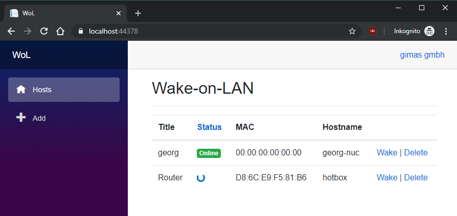

# Blazor Wake-on-LAN

This is a [Wake-on-LAN](https://en.wikipedia.org/wiki/Wake-on-LAN) app for your network, written in server-side blazor. I developed it for internal use at my workplace and because I wanted to build a small, limited-scope but fully-working and done-right blazor app. [Getting started](#getting-started) is as easy as downloading and running. Feel free to improve/fork/PR this if you think I could have done anything better.

## Features

* Wake arbitrary hosts on the network of the server where this is hosted via [Magic Packet](https://superuser.com/a/1066637)
* Add new hosts via the webinterface using either their hostname or their mac address.
* Detect the online status of saved hosts. To determine, they are at the same time [ping](https://en.wikipedia.org/wiki/Ping_(networking_utility))ed and we try to establish a TCP connection on port 3389. This port [is used](https://serverfault.com/a/12006) by the Microsoft Remote Desktop Protocol. This way, we can work with hosts that don't answer normal pings.
* Delete existing hosts from the list.
* When waking a host, the application repeatedly tries to reach the host and updates you about the status. You see immediately when the host finished booting so that you can connect via ssh/RDP/etc..

## Showcase

This application uses the following techniques and might be suitable as a simple but full-fledged example of how they work:

* [Blazor](https://dotnet.microsoft.com/apps/aspnet/web-apps/blazor)
  * Components and Pages in Razor
  * UI-Server-interaction which would typically require AJAX/writing JavaScript. See the `Wake` page and the *Status* column of the index page.
* .Net Core 3.1
* [Entity Framework Core](https://docs.microsoft.com/en-us/ef/core/) Code First
  * Automatic Migrations
  * Supports T-SQL and SQLite, selection by connection string in `appsettings.json`
* Dependency Injection using [`Microsoft.Extensions.DependencyInjection`](https://www.nuget.org/packages/Microsoft.Extensions.DependencyInjection/)
* Continuous Integration using Azure Pipelines.

## Getting Started

1. Download and unzip the [latest release](https://github.com/georg-jung/BlazorWoL/releases/latest/download/WoL.zip).
2. Run the application by starting `WoL.exe`
3. Open the shown location in a browser (probably `localhost:5000`) and add your first host.

You can add the application in IIS for more serious hosting. You can set up T-SQL as a backend for backup etc.. See the [`appsettings.json` file](appsettings.json) for details.